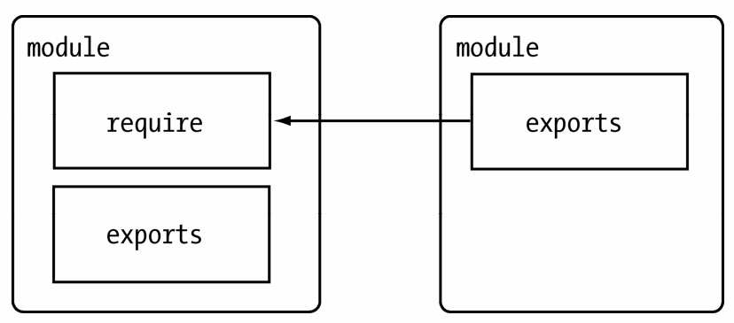

# CommonJS规范

## CommonJS的模块规范

1. 模块引用 
在CommonJS规范中，存在require()方法，这个方法接受一个模块标识，以此引入一个模块的API到当前的上下文中。
2. 模块定义 
在模块中，上下文提供require()方法来引入外部模块。对应引入的功能，上下文提供了exports对象用于导出当前模块的方法或者变量，并且他是唯一的导出接口。在模块中，还存在一个module对象，它代表模块自身，exports是module的属性。
3. 模块标识 
模块标识其实就是传递给require()方法的参数，它必须是符合 小驼峰命名的字符串，或者是相对路径，绝对路径。
每个模块具有独立的空间，它们互不干扰，在引用的时候也显得干净利落,用户也**完全不用考虑变量污染**。

## Node的模块实现

在Node中引入模块，需要经历一下3个步骤： 
1. 路径分析
2. 文件定位
3. 编译执行
而模块又分为两类，一类是核心模块，既Node提供的模块；一类是文件模块，既用户自己编写的模块。
- 核心模块，在Node源代码的编译过程中，编译成了二进制模块，在Node进程启动时，部分核心模块直接加载进了内存中，所以部分核心模块引入时，文件定位和编译执行被忽略掉，路径分析也优先判断，所以它的加载速度是最快的
- 文件模型是运行时动态加载，需要完整的三个步骤流程才行，所速度会比核心模块慢。

需要注意的是，Node和前端浏览器会缓存静态脚本文件以提高性能一样，Node也会对引入的模块进行缓存，不过浏览器仅仅缓存文件，而**Node缓存的是编译和执行之后的对象**（require对相同模块的二次加载一律采用缓存优先的方式，不过核心模块的缓存检查还是先于文件模块的缓存检查）

### 路径分析
 