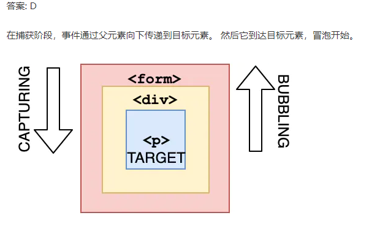

# javascript输出题
## 下面的代码输出什么？（隐式转换）
```js
let a = 3;
let b = new Number(3);
let c = 3;

console.log(a == b);
console.log(a === b);
console.log(b === c);
```
<details>
<summary>答案</summary>

true
false
false

new Number（）是一个内置的函数构造函数。 虽然它看起来像一个数字，但它并不是一个真正的数字：它有一堆额外的功能，是一个对象。
当我们使用==运算符时，它只检查它是否具有相同的值。 他们都有3的值，所以它返回true。

>译者注：==会引发隐式类型转换，右侧的对象类型会自动拆箱为Number类型。

然而，当我们使用===操作符时，类型和值都需要相等，new Number()不是一个数字，是一个对象类型。两者都返回 false。

</details>

## 下面的代码输出什么？(new)
```js
function Person(firstName, lastName) {
  this.firstName = firstName;
  this.lastName = lastName;
}

const lydia = new Person("Lydia", "Hallie");
const sarah = Person("Sarah", "Smith");

console.log(lydia);
console.log(sarah);

```
- `A: Person {firstName: "Lydia", lastName: "Hallie"} and undefined`
- `B: Person {firstName: "Lydia", lastName: "Hallie"} and Person {firstName: "Sarah", lastName: "Smith"}`
- `C: Person {firstName: "Lydia", lastName: "Hallie"} and {}`
- `D:Person {firstName: "Lydia", lastName: "Hallie"} and ReferenceError`

<details>
<summary>答案</summary>

对于sarah，我们没有使用new关键字。 使用new时，它指的是我们创建的新空对象。 但是，如果你不添加new它指的是全局对象！
我们指定了this.firstName等于'Sarah和this.lastName等于Smith。 我们实际做的是定义global.firstName ='Sarah'和global.lastName ='Smith。 sarah本身的返回值是undefined。

</details>

## 事件传播的三个阶段是什么？?
- A: 目标 > 捕获 > 冒泡
- B: 冒泡 > 目标 > 捕获
- C: 目标 > 冒泡 > 捕获
- D: 捕获 > 目标 > 冒泡

<details>
<summary>答案</summary>



</details>


## 模板字符串
```js
function getPersonInfo(one, two, three) {
  console.log(one);
  console.log(two);
  console.log(three);
}

const person = "Lydia";
const age = 21;

getPersonInfo`${person} is ${age} years old`;
```

- `A: Lydia 21 ["", "is", "years old"]`
- `B: ["", "is", "years old"] Lydia 21`
- `C: Lydia ["", "is", "years old"] 21`

<details>
<summary>答案</summary>

答案: B

如果使用标记的模板字符串，则第一个参数的值始终是字符串值的数组。 其余参数获取传递到模板字符串中的表达式的值！

</details>

## 对象类型转换
```js
function checkAge(data) {
  if (data === { age: 18 }) {
    console.log("You are an adult!");
  } else if (data == { age: 18 }) {
    console.log("You are still an adult.");
  } else {
    console.log(`Hmm.. You don't have an age I guess`);
  }
}

checkAge({ age: 18 });
```
- `A: You are an adult!`
- `B: You are still an adult.`
- `C: Hmm.. You don't have an age I guess`

<details>
<summary>答案</summary>

答案: c

在比较相等性，**原始类型通过它们的值进行比较，而对象通过它们的引用进行比较**。JavaScript检查对象是否具有对内存中相同位置的引用。
我们作为参数传递的对象和我们用于检查相等性的对象在内存中位于不同位置，所以它们的引用是不同的。
这就是为什么{ age: 18 } === { age: 18 }和 { age: 18 } == { age: 18 } 返回 false的原因

</details>

### obj存值
```js
const a = {};
const b = { key: "b" };
const c = { key: "c" };

a[b] = 123;
a[c] = 456;

console.log(a[b]);
```

- `A: 123`
- `B: 456`
- `C: undefined`
- `D: ReferenceError`

<details>
<summary>答案</summary>

答案: B

对象键自动转换为字符串。我们试图将一个对象设置为对象a的键，其值为123。
但是，当对象自动转换为字符串化时，它变成了`[Object object]`。 所以我们在这里说的是`a["Object object"] = 123`。 然后，我们可以尝试再次做同样的事情。 c对象同样会发生隐式类型转换。那么，`a["Object object"] = 456`。
然后，我们打印`a[b]`，它实际上是`a["Object object"]`。 我们将其设置为456，因此返回456。

</details>


## 单击下面的html片段打印的内容是什么?

```js
<div onclick="console.log('div')">
  <p onclick="console.log('p')">
    Click here!
  </p>
</div>
```

- `A: p div`
- `B: div p`
- `C: p`
- `D: div`

<details>
<summary>答案</summary>

答案: A

如果我们单击p，我们会看到两个日志：p和div。在事件传播期间，有三个阶段：捕获，目标和冒泡。 默认情况下，事件处理程序在冒泡阶段执行（除非您将useCapture设置为true）。 它从最深的嵌套元素向外延伸。

</details>

## setInterval方法的返回值什么?
```js
setInterval(() => console.log("Hi"), 1000);
```

- `A：一个唯一的id`
- `B：指定的毫秒数`
- `C：传递的函数`
- `D：undefined`

<details>
<summary>答案</summary>

答案: A

它返回一个唯一的id。 此id可用于使用clearInterval()函数清除该定时器。

</details>

